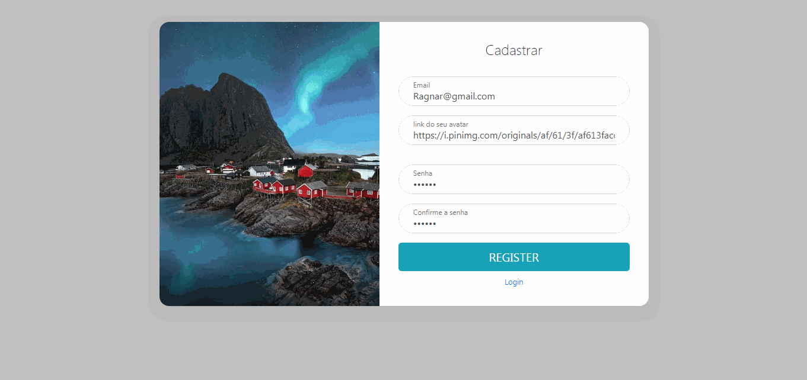

 # Vou arrumar o Readme para a explicação até terça-feira(18/02/2020)
> O código está funcional e todo comentado

a versão  **chat demonstração** é a demostrada no gif e está mais completa. Já vem com o banco de dados(cha demonstração\chat-backend\src\database.sql)

a versão **chat para implantação** contem código mais básico, para voce poder editar com mais facilidade e adicionar seu banco de dado

## Instalação
execute o comando na pasta chat-backend

```bash
yarn install
```

