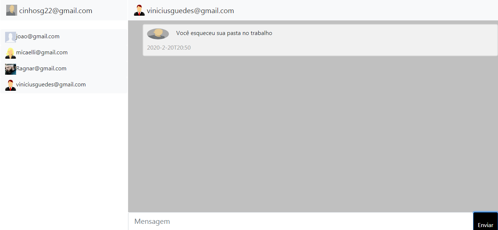

<h1 align="center">Como usar o chat demonstração</h1>

>Essa versão está toda comentada para uso de aprendizado, mas ela só foi criado com o objetivo de demonstrar como poderia ser feito o uso do **chat implantação** 

## Instalação
Para instalar utilize os comandos:
```bash
yarn install
```
e após a instalação crie o banco de dados, o sql está localizado em .\chat-backend\database.sql

## inicie o backend**
use o comando 
```bash
yarn nodemon src/index.js
```
## Cadastrar


Para cadastrar é só preencher as informações. LOgo após criar será redirecionado

## Login


Para fazer login é só clicar no link escrito cadastrar

## Coversar


Para mandar mensagem privada, basta clicar no usuário que queira conversar e escrever as mensagens

