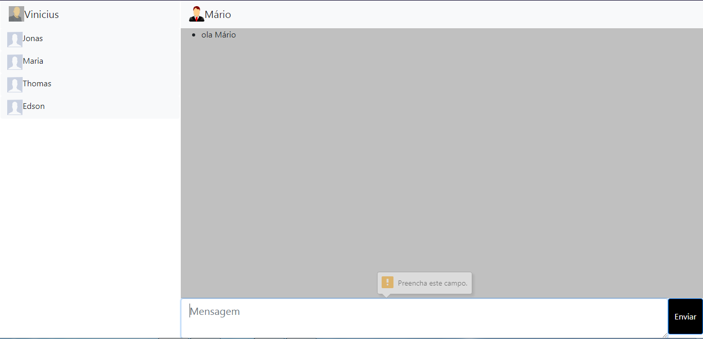

<h1 align="center">Como usar o chat para implatação</h1>

>Essa versão está toda comentada e está com pouco código para fácil uso para editar do seu jeito e adicionar o seu banco de dados(está tudo comentado como adicionar o banco de dados) e fácil implatanação no seu projeto.

## Instalação
Para instalar utilize o comando abaixo na pasta ./chat-backend:
```bash
yarn install
```

## inicie o backend**
use o comando 
```bash
yarn nodemon src
```

## inicie o mobile**
use o comando 
```bash
yarn start
```

## Como usar

**web:**



**Mobile:**


Para mandar mensagem é só escrever, e nisso será mandado a mensagem para todos os usuários que estão na mesma página

